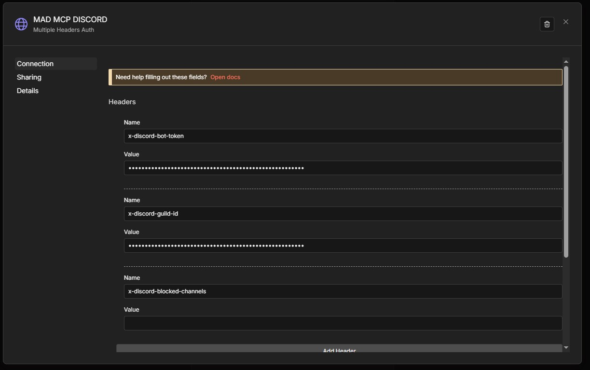

<p align="center">
  
</p>

<p align="center">
  <a href="LICENSE"></a>
  <a href="https://www.java.com/"></a>
  <a href="https://www.python.org/"></a>
  <a href="https://modelcontextprotocol.io/"></a>
  <a href="https://discord.com/developers/docs/intro"></a>
  <a href="https://github.com/MADPANDA3D/DISCORD-MCP/releases"></a>
  <a href="https://github.com/MADPANDA3D/DISCORD-MCP/issues"></a>
  <a href="https://github.com/MADPANDA3D/DISCORD-MCP"></a>
</p>

<h1 align="center"><strong>MADPANDA3D DISCORD MCP</strong></h1>
<p align="center"><strong>Operate Discord with MCP-native tools</strong></p>
<p align="center">
  MADPANDA3D Discord MCP is a production-ready Model Context Protocol server for the Discord API.
  It blends a Spring Boot JDA core with a FastMCP HTTP transport so agents can automate Discord
  safely and at scale.
</p>
<p align="center">
  Manage channels, moderate users, schedule audits, and run async jobs without leaving your
  MCP-compatible client. Built for clean ops, consistent controls, and predictable automation.
</p>

## Overview

This server supports both STDIO and HTTP streamable transports.  The hosted endpoint uses header
authentication so clients can bring their own Discord bot credentials.

## Hosted MCP (Header Auth)

Use the MADPANDA3D hosted endpoint:

```
https://discord--mcp.madpanda3d.com/mcp
```

n8n setup:

1. Add **MCP tool node** to your agent.
2. Add the MCP endpoint URL.
3. Set **Server transport** to **HTTP streamable**.
4. Set **Auth** to **Multiple Headers Auth**.
5. Add headers:
   - `X-Discord-Bot-Token`
   - `X-Discord-Guild-Id`
   - `X-Discord-Blocked-Channels` (required; can be empty)
6. Save the auth credentials.
7. Set **Tools to include** -> **All**.

## n8n Setup

Screenshots below show the MCP node configuration in n8n (steps 1-3).

<p align="center">
  
</p>
<p align="center">
  
</p>
<p align="center">
  
</p>

## Deploy

- [](https://www.hostinger.com/cart?product=vps%3Avps_kvm_4&period=12&referral_type=cart_link&REFERRALCODE=ZUWMADPANOFE&referral_id=0199a492-531e-70d3-83f5-e28eb919466d)

<details>
<summary>VPS Deployment (Nginx Proxy Manager)</summary>

Attach the FastMCP container to the same Docker network as Nginx Proxy Manager (usually `npm_default`).

NPM host settings:
- Forward Hostname/IP: `discord-mcp`
- Forward Port: `8085`
- Websockets: ON
- HTTP/2: OFF
- Advanced: empty

Then point n8n to:
- Endpoint: `https://discord--mcp.madpanda3d.com/mcp`
- Transport: HTTP Streamable

</details>

## Quickstart

<details>
<summary>FastMCP (Docker Compose)</summary>

```bash
cd fastmcp
cp .env.example .env
# Edit .env with your DISCORD_TOKEN and DISCORD_GUILD_ID (or enable header overrides)
docker compose -f fastmcp/docker-compose.yaml up -d --build
```

</details>

<details>
<summary>FastMCP (Python)</summary>

```bash
pip install -r fastmcp/requirements.txt
python fastmcp/discord_mcp_server.py
```

</details>

<details>
<summary>Java (Spring Boot)</summary>

```bash
mvn clean package
java -jar target/discord-mcp-*.jar
```

</details>

## HTTP Transport

The FastMCP server in `fastmcp/` exposes a single `/mcp` endpoint for GET and POST.

Endpoints:
- `GET /mcp` -> SSE stream for server-initiated notifications
- `POST /mcp` -> JSON-RPC requests (returns JSON or SSE per request)

<details>
<summary>Example curl flow</summary>

```bash
# 1) Initialize session
curl -i -X POST http://localhost:8085/mcp \
  -H "Content-Type: application/json" \
  -H "Accept: application/json, text/event-stream" \
  -d '{"jsonrpc":"2.0","id":1,"method":"initialize","params":{"protocolVersion":"2025-03-26","capabilities":{},"clientInfo":{"name":"test","version":"1.0"}}}'

# 2) List tools
curl -i -X POST http://localhost:8085/mcp \
  -H "Content-Type: application/json" \
  -H "Accept: application/json, text/event-stream" \
  -d '{"jsonrpc":"2.0","id":2,"method":"tools/list","params":{}}'
```

</details>

## Tools

<details>
<summary>Server Information</summary>

- `get_server_info`: detailed server metadata and permissions
- `discord_health_check`: status, warnings, permissions, and rate-limit snapshot
- `discord_smoke_test`: health check + dry-run + send + optional edit/delete + read-back

</details>

<details>
<summary>Operations</summary>

- `discord_ack`: post standardized acknowledgement messages
- `discord_job_submit`: submit an async job (returns `task_id`)
- `discord_job_status`: check async job status and optional result

</details>

<details>
<summary>User Management</summary>

- `get_user_id_by_name`: resolve a Discord user ID for pings
- `send_private_message`: send a DM
- `edit_private_message`: edit a DM
- `delete_private_message`: delete a DM
- `read_private_messages`: read recent DM history

</details>

<details>
<summary>Moderation (confirm-gated)</summary>

- `timeout_member`
- `remove_timeout`
- `kick_member`
- `ban_member`
- `unban_member`
- `add_role`
- `remove_role`
- `edit_nickname`

</details>

<details>
<summary>Message Management</summary>

- `send_message`: send messages (supports `dry_run`, embeds, auto-splitting)
- `edit_message`: edit messages (admin + confirm)
- `delete_message`: delete messages (admin + confirm)
- `read_messages`: read recent history
- `search_messages`: search with filters
- `analyze_attachment`: OCR or describe image attachments (OpenAI vision)
- `add_reaction`: add a reaction
- `remove_reaction`: remove a reaction

</details>

<details>
<summary>Thread Management</summary>

- `list_threads`
- `create_thread`
- `archive_thread`
- `unarchive_thread`

</details>

<details>
<summary>Audits</summary>

- `channel_daily_audit`
- `daily_audit_job_submit`
- `daily_audit_job_status`
- `daily_audit_job_next`

</details>

<details>
<summary>Channel Management</summary>

- `create_text_channel`
- `delete_channel`
- `find_channel`
- `list_channels`

</details>

<details>
<summary>Category Management</summary>

- `create_category`
- `delete_category`
- `find_category`
- `list_channels_in_category`

</details>

<details>
<summary>Webhook Management</summary>

- `create_webhook`
- `delete_webhook`
- `list_webhooks`
- `send_webhook_message`

</details>

## Configuration

<details>
<summary>Environment Variables</summary>

| Name                            | Description                                                                 | Default Value                     |
|---------------------------------|-----------------------------------------------------------------------------|-----------------------------------|
| `DISCORD_TOKEN`                 | Discord bot token (required unless using request headers)                  | None                              |
| `DISCORD_GUILD_ID`              | Default guild/server ID (required unless using request headers)            | None                              |
| `DISCORD_PRIMARY_CHANNEL_ID`    | Default channel ID for send/read tools                                     | unset                             |
| `DISCORD_ALLOWED_CHANNEL_IDS`   | Comma-separated allowlist for send/edit/delete (`ALL` or `*` to allow all) | unset                             |
| `DISCORD_BLOCKED_CHANNEL_IDS`   | Comma-separated blocklist for reads/writes                                 | unset                             |
| `DISCORD_ALLOW_ALL_READ`        | Allow reads across all channels                                            | `false`                           |
| `DISCORD_DM_ENABLED`            | Enable DM tools                                                            | `false`                           |
| `DISCORD_AUDIT_TIMEZONE`        | Timezone for audit tools                                                   | `America/Los_Angeles`             |
| `DISCORD_PROTECTED_USER_IDS`    | Comma-separated user IDs protected from moderation                         | unset                             |
| `DISCORD_PROTECTED_ROLE_IDS`    | Comma-separated role IDs protected from moderation                         | unset                             |
| `DISCORD_ALLOWED_TARGET_ROLE_IDS` | Restrict moderation to members with these roles                         | unset                             |
| `DISCORD_CHANNEL_CACHE_TTL_SECONDS` | Channel name cache TTL in seconds                                     | `600`                             |
| `DISCORD_JOB_TTL_SECONDS`       | Async job retention TTL in seconds                                         | `3600`                            |
| `MCP_BOT_POOL_TTL_SECONDS`      | Idle TTL for bot clients in the pool                                       | `900`                             |
| `LOG_LEVEL`                     | Log level                                                                  | `INFO`                            |
| `LOG_REDACT_MESSAGE_CONTENT`    | Redact message content in logs/results                                     | `true`                            |
| `MCP_ADMIN_TOOLS_ENABLED`       | Enable admin-gated edit/delete tools                                       | `false`                           |
| `MCP_REQUIRE_CONFIRM`           | Require `confirm="CONFIRM APPLY"` for confirm-gated tools                  | `false`                           |
| `MCP_HTTP_PORT`                 | HTTP server port                                                          | `8085`                            |
| `MCP_BIND_ADDRESS`              | HTTP bind address                                                         | `0.0.0.0`                         |
| `MCP_TRANSPORT`                 | Transport type                                                             | `streamable-http`                 |
| `MCP_STDIO`                     | Enable STDIO transport                                                     | `false`                           |
| `MCP_ALLOW_REQUEST_OVERRIDES`   | Enable per-request headers for public endpoints                            | `false`                           |
| `OPENAI_VISION_ENABLED`         | Enable OpenAI vision (attachment OCR/describe)                             | `false`                           |
| `OPENAI_VISION_MODEL`           | OpenAI model for vision                                                    | `gpt-4o-mini`                     |
| `OPENAI_VISION_API_URL`         | OpenAI API URL for vision                                                  | `https://api.openai.com/v1/chat/completions` |
| `OPENAI_VISION_MAX_MB`          | Max attachment size for vision (MB)                                        | `10`                              |
| `OPENAI_VISION_TIMEOUT_SECONDS` | OpenAI request timeout (seconds)                                           | `30`                              |
| `MCP_OPENAI_API_HEADER`         | Header name for OpenAI API key                                             | `x-openai-api`                    |
| `MCP_REQUIRE_REQUEST_DISCORD_TOKEN` | Require bot token header (if overrides enabled)                        | `false`                           |
| `MCP_REQUIRE_REQUEST_GUILD_ID`  | Require guild id header (if overrides enabled)                             | `false`                           |
| `MCP_REQUIRE_REQUEST_BLOCKED_CHANNELS` | Require blocked channels header (if overrides enabled)              | `false`                           |
| `MCP_DISCORD_TOKEN_HEADER`      | Header name for bot token                                                  | `x-discord-bot-token`             |
| `MCP_DISCORD_GUILD_ID_HEADER`   | Header name for guild id                                                   | `x-discord-guild-id`              |
| `MCP_DISCORD_BLOCKED_CHANNELS_HEADER` | Header name for blocked channels                                    | `x-discord-blocked-channels`      |

Note: header auth only applies to HTTP transport; STDIO cannot pass headers.
Confirm gating is controlled by `MCP_REQUIRE_CONFIRM` (set `true` to enforce `confirm="CONFIRM APPLY"`).

</details>

### Hosted MCP (Bring Your Own Discord Bot)

If you expose FastMCP publicly, require clients to supply their own bot token and guild ID.

Server env (recommended for public endpoints):

```bash
MCP_ALLOW_REQUEST_OVERRIDES=true
MCP_REQUIRE_REQUEST_DISCORD_TOKEN=true
MCP_REQUIRE_REQUEST_GUILD_ID=true
MCP_REQUIRE_REQUEST_BLOCKED_CHANNELS=true
```

Client headers:
- `X-Discord-Bot-Token`: Discord bot token (required, not a user token)
- `X-Discord-Guild-Id`: guild id (required)
- `X-Discord-Blocked-Channels`: blocked channel names (required, may be empty)

Blocked channel format: `#channel, #channel` (spaces optional). If a channel
name does not match, the request still succeeds and a warning is returned.

If required headers are missing, the server returns a JSON-RPC error with
`type=permission_denied` and `diagnostics.required_headers` listing the
missing header names.

Optional OpenAI vision (for `analyze_attachment`):

Server env:

```bash
OPENAI_VISION_ENABLED=true
MCP_OPENAI_API_HEADER=x-openai-api
```

Client header:
- `X-OpenAI-Api`: OpenAI API key (required for vision; omitted headers return permission_denied)

Example OCR call (include `X-OpenAI-Api` header in the request):

```json
{"jsonrpc":"2.0","id":30,"method":"tools/call","params":{"name":"analyze_attachment","arguments":{"channel_id":"123456789012345678","message_id":"123456789012345679","attachment_index":"0","mode":"ocr"}}}
```

## Examples (FastMCP JSON-RPC)

Timeout a member:
```json
{"jsonrpc":"2.0","id":10,"method":"tools/call","params":{"name":"timeout_member","arguments":{"user_id":"123456789012345678","duration_minutes":"30","reason":"Spam","confirm":"CONFIRM APPLY"}}}
```

Ban a member (delete last 1 day of messages):
```json
{"jsonrpc":"2.0","id":11,"method":"tools/call","params":{"name":"ban_member","arguments":{"user_id":"123456789012345678","delete_message_days":"1","reason":"Raid","confirm":"CONFIRM APPLY"}}}
```

Add a role:
```json
{"jsonrpc":"2.0","id":12,"method":"tools/call","params":{"name":"add_role","arguments":{"user_id":"123456789012345678","role_id":"987654321098765432","reason":"Verified","confirm":"CONFIRM APPLY"}}}
```

Edit nickname (clear by sending empty string):
```json
{"jsonrpc":"2.0","id":13,"method":"tools/call","params":{"name":"edit_nickname","arguments":{"user_id":"123456789012345678","nickname":"","reason":"Reset","confirm":"CONFIRM APPLY"}}}
```

Daily audit job flow (one channel per step):
```json
{"jsonrpc":"2.0","id":20,"method":"tools/call","params":{"name":"daily_audit_job_submit","arguments":{"date":"2026-01-12","channel_ids":["1455591724532629627","1411052130709667850"]}}}
{"jsonrpc":"2.0","id":21,"method":"tools/call","params":{"name":"daily_audit_job_next","arguments":{"task_id":"<task_id_from_submit>","limit":"50"}}}
{"jsonrpc":"2.0","id":22,"method":"tools/call","params":{"name":"daily_audit_job_status","arguments":{"task_id":"<task_id_from_submit>","include_results":true}}}
```

## License

MIT.

## Support

[](https://donate.stripe.com/cNidRbdkAbdP8iU7SD4ko0b)

## Affiliate Links

<details>
<summary>Services I use (affiliate)</summary>

Using these links helps support continued development.

### Hostinger VPS
- [KVM 1](https://www.hostinger.com/cart?product=vps%3Avps_kvm_1&period=12&referral_type=cart_link&REFERRALCODE=ZUWMADPANOFE&referral_id=0199a491-d783-7057-85d2-27de6e01e2c5)
- [KVM 2](https://www.hostinger.com/cart?product=vps%3Avps_kvm_2&period=12&referral_type=cart_link&REFERRALCODE=ZUWMADPANOFE&referral_id=0199a492-26cf-7333-b6d7-692e17bf8ce1)
- [KVM 4](https://www.hostinger.com/cart?product=vps%3Avps_kvm_4&period=12&referral_type=cart_link&REFERRALCODE=ZUWMADPANOFE&referral_id=0199a492-531e-70d3-83f5-e28eb919466d)
- [KVM 8](https://www.hostinger.com/cart?product=vps%3Avps_kvm_8&period=12&referral_type=cart_link&REFERRALCODE=ZUWMADPANOFE&referral_id=0199a492-7ce9-70fb-b96c-2184abc56764)

### Cloud Hosting
- [Cloud Economy](https://www.hostinger.com/cart?product=hosting%3Acloud_economy&period=12&referral_type=cart_link&REFERRALCODE=ZUWMADPANOFE&referral_id=0199a48f-e7fa-7358-9ff0-f9ba2e8d6e36)
- [Cloud Professional](https://www.hostinger.com/cart?product=hosting%3Acloud_professional&period=12&referral_type=cart_link&REFERRALCODE=ZUWMADPANOFE&referral_id=0199a490-20fd-70bc-959e-a1f2cd9a69a6)
- [Cloud Enterprise](https://www.hostinger.com/cart?product=hosting%3Acloud_enterprise&period=12&referral_type=cart_link&REFERRALCODE=ZUWMADPANOFE&referral_id=0199a490-5972-72e4-850f-40d618988dc1)

### Web Hosting
- [Premium](https://www.hostinger.com/cart?product=hosting%3Ahostinger_premium&period=12&referral_type=cart_link&REFERRALCODE=ZUWMADPANOFE&referral_id=0199a48f-4c21-7199-9918-8f31a3f6a0d9)
- [Business](https://www.hostinger.com/cart?product=hosting%3Ahostinger_business&period=12&referral_type=cart_link&REFERRALCODE=ZUWMADPANOFE&referral_id=0199a48f-1135-72ba-acbb-13e0e7550db0)

### Website Builder
- [Premium](https://www.hostinger.com/cart?product=hosting%3Ahostinger_premium&period=12&referral_type=cart_link&REFERRALCODE=ZUWMADPANOFE&referral_id=0199a492-f240-7309-b3fe-9f6909fbc769&product_type=website-builder)
- [Business](https://www.hostinger.com/cart?product=hosting%3Ahostinger_business&period=12&referral_type=cart_link&REFERRALCODE=ZUWMADPANOFE&referral_id=0199a492-7ce9-70fb-b96c-2184abc56764)

### Agency Hosting
- [Startup](https://www.hostinger.com/cart?product=hosting%3Aagency_startup&period=12&referral_type=cart_link&REFERRALCODE=ZUWMADPANOFE&referral_id=0199a490-d03c-71de-9acf-08fd4fa911de)
- [Growth](https://www.hostinger.com/cart?product=hosting%3Aagency_growth&period=12&referral_type=cart_link&REFERRALCODE=ZUWMADPANOFE&referral_id=0199a491-6af4-731f-8947-f1458f07fa5b)
- [Professional](https://www.hostinger.com/cart?product=hosting%3Aagency_professional&period=12&referral_type=cart_link&REFERRALCODE=ZUWMADPANOFE&referral_id=0199a491-03fb-73f8-9910-044a0a33393a)

### Email
- [Business Pro](https://www.hostinger.com/cart?product=hostinger_mail%3Apro&period=12&referral_type=cart_link&REFERRALCODE=ZUWMADPANOFE&referral_id=0199a493-5c27-727b-b7f9-8747ffb4e5ee)
- [Business Premium](https://www.hostinger.com/cart?product=hostinger_mail%3Apremium&period=12&referral_type=cart_link&REFERRALCODE=ZUWMADPANOFE&referral_id=0199a493-a3fc-72b8-a961-94ed6e1c70e6)

### Reach
- [Reach 500](https://www.hostinger.com/cart?product=reach%3A500&period=12&referral_type=cart_link&REFERRALCODE=ZUWMADPANOFE&referral_id=0199a494-3ebf-7367-b409-9948de50a297)
- [Reach 1000](https://www.hostinger.com/cart?product=reach%3A1000&period=12&referral_type=cart_link&REFERRALCODE=ZUWMADPANOFE&referral_id=0199a494-8bb9-726e-bb8d-9de9a72a3c21)
- [Reach 2500](https://www.hostinger.com/cart?product=reach%3A2500&period=12&referral_type=cart_link&REFERRALCODE=ZUWMADPANOFE&referral_id=0199a494-c9c1-7191-b600-cafa2e9adafc)

</details>

## Contact

Open an issue in `MADPANDA3D/DISCORD-MCP`.

<p align="center">
  
  <br />
  <strong>MADPANDA3D</strong>
</p>
